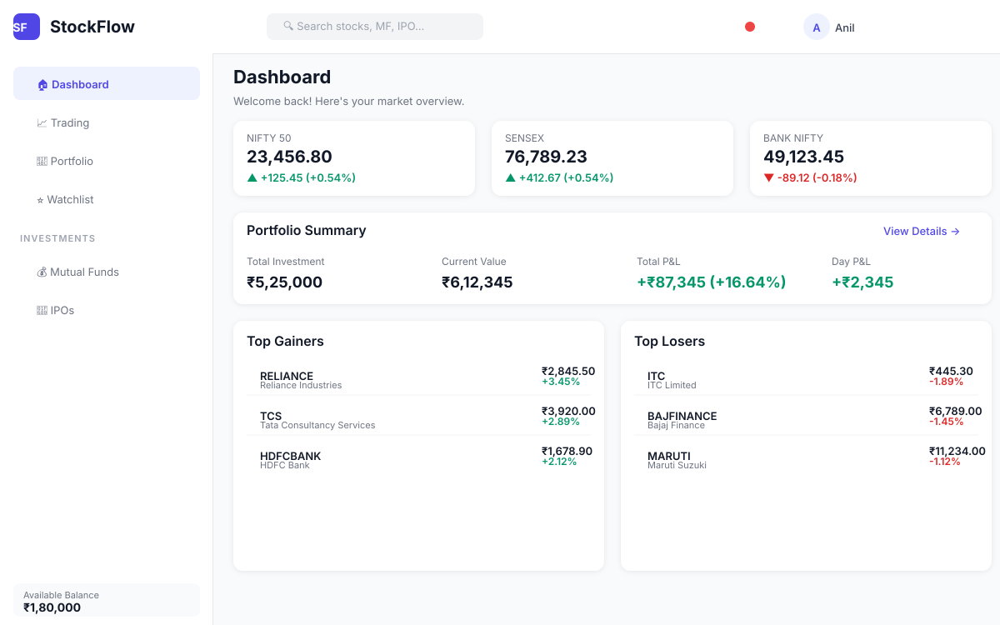
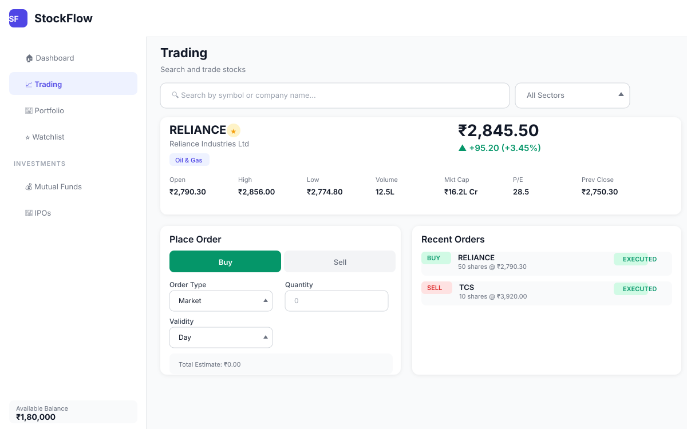
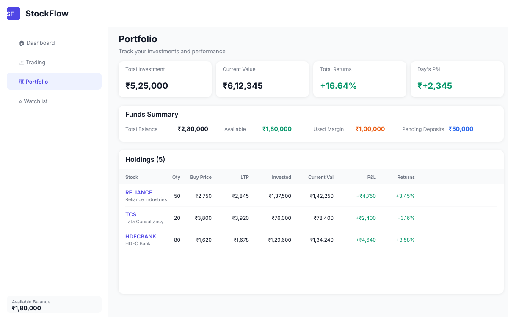
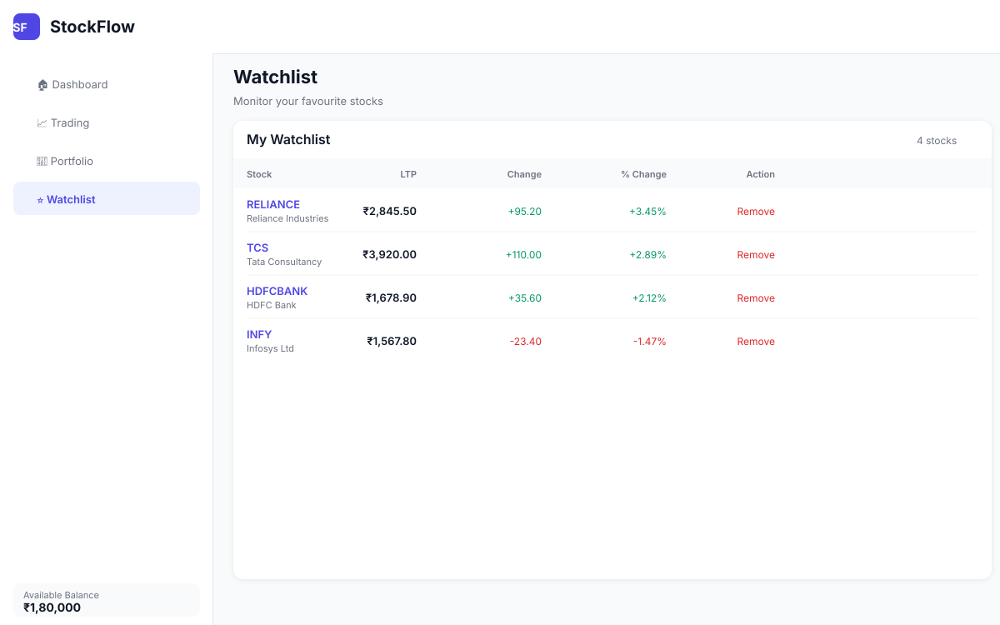
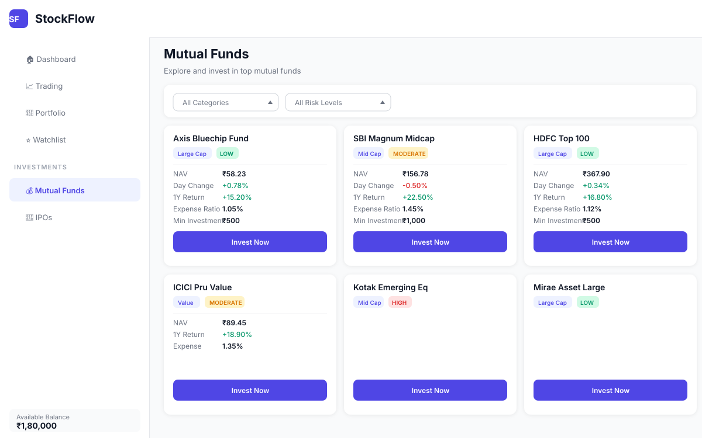
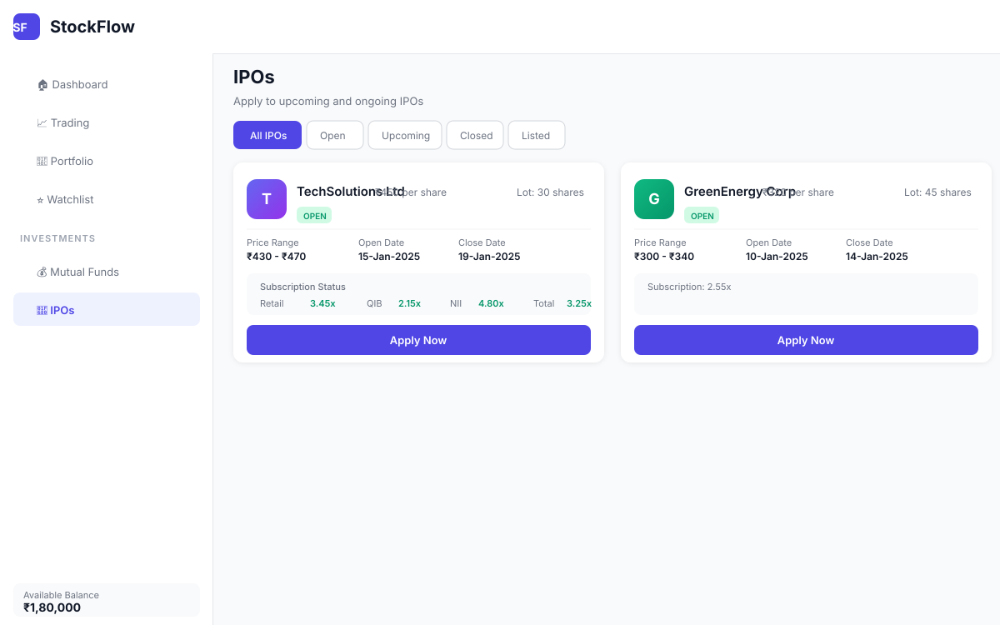
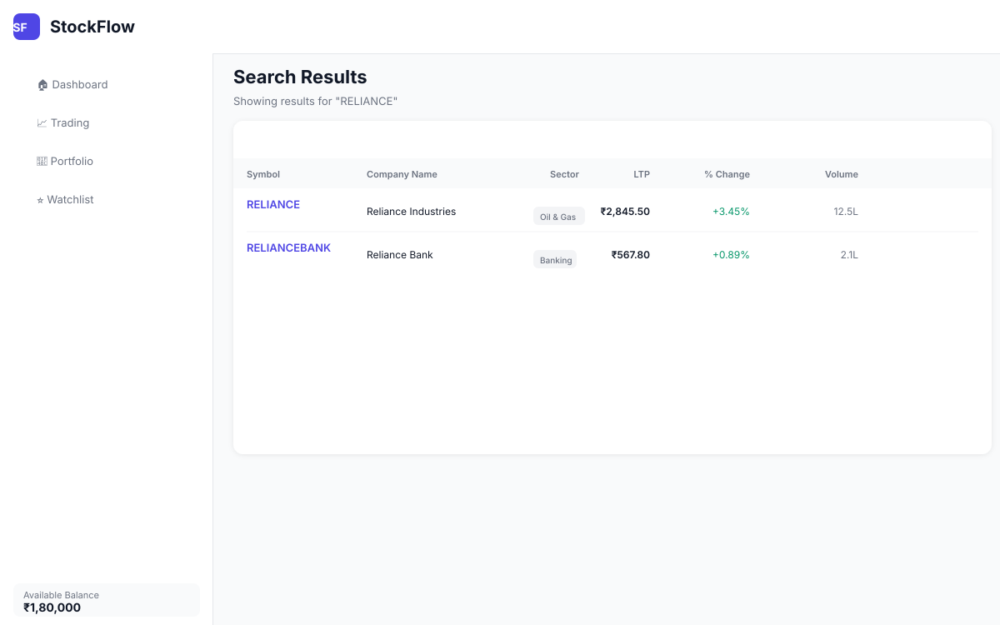
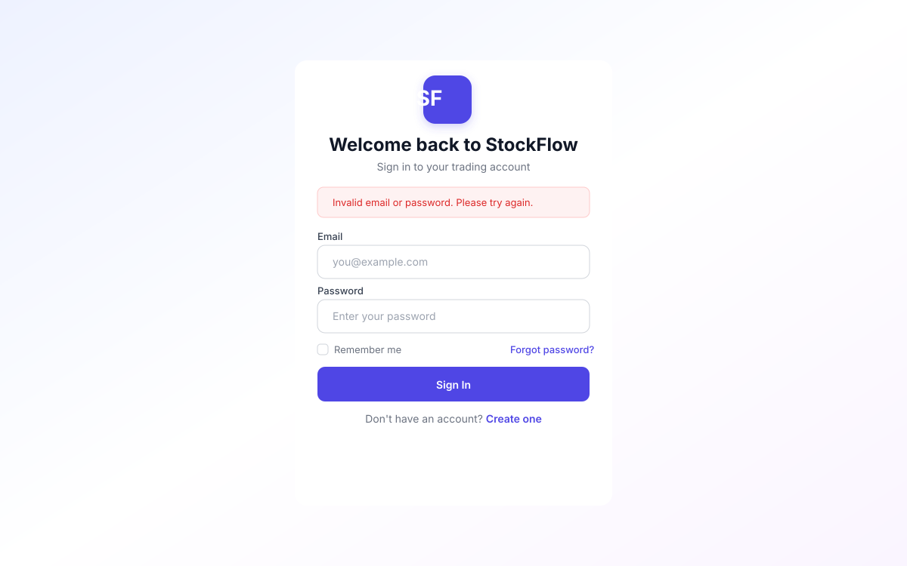
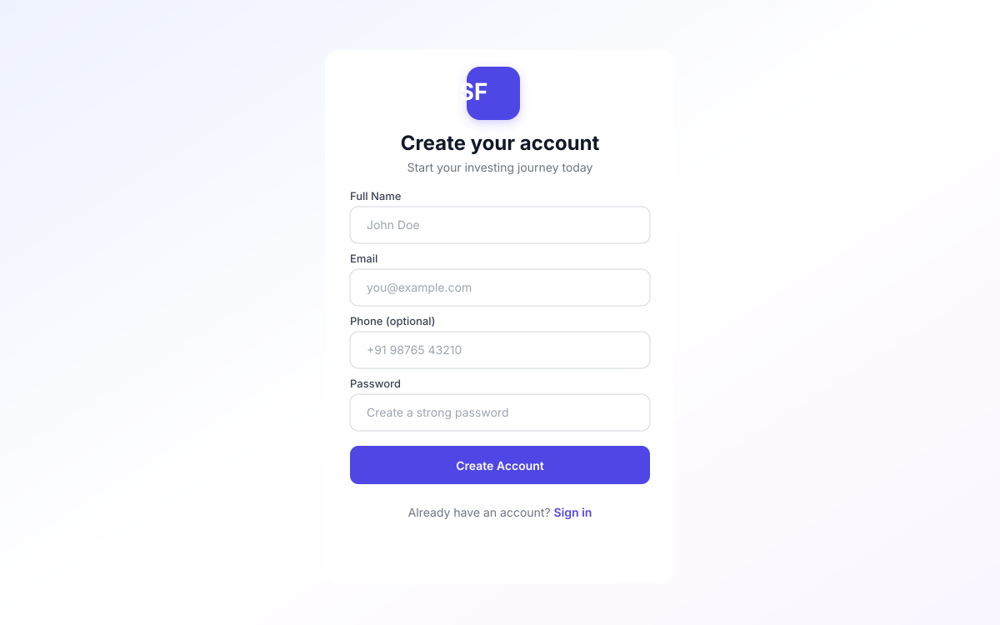

# StockFlow Platform 📈

[](https://www.oracle.com/java/)
[](https://spring.io/projects/spring-boot)
[](https://angular.dev/)
[](https://kafka.apache.org/)
[](https://www.postgresql.org/)
[](https://redis.io/)
[](https://www.docker.com/)

**A Groww-like Stock Brokerage Platform** built with 25+ Spring Boot microservices, providing real-time stock trading, portfolio management, mutual funds, IPOs, and market data analytics.

---

## 📸 Screenshots

| Dashboard | Trading |
|:---:|:---:|
|  |  |

| Portfolio | Watchlist |
|:---:|:---:|
|  |  |

| Mutual Funds | IPOs |
|:---:|:---:|
|  |  |

| Search | Login | Register |
|:---:|:---:|:---:|
|  |  |  |

---

## Architecture Overview 🏗️

StockFlow is built with **25+ Spring Boot microservices** communicating via **Apache Kafka** and **REST/GraphQL APIs**, backed by **PostgreSQL**, **MongoDB**, and **Redis**.

```
┌─────────────────────────────────────────────────────┐
│                    API Gateway                       │
│              (Spring Cloud Gateway)                  │
├─────────────────────────────────────────────────────┤
│  Auth    │  Order    │  Market    │  Holdings       │
│  Service │  Service  │  Data Svc  │  Service        │
├──────────┴──────────┼────────────┴─────────────────┤
│  MF       │  SIP     │  IPO      │  Funds          │
│  Service  │  Service │  Service  │  Service        │
├───────────┴─────────┴───────────┴─────────────────┤
│  Notification│  Alert    │  Report  │  Analytics    │
│  Service     │  Service  │  Service │  Service      │
├──────────────┴──────────┴──────────┴──────────────┤
│  Eureka Discovery  │  Config Server  │  Audit Svc   │
├────────────────────┴─────────────────┴────────────┤
│           Infrastructure Layer                     │
│  Kafka │ PostgreSQL │ MongoDB │ Redis │ Zipkin     │
└────────────────────────────────────────────────────┘
```

## Tech Stack 🛠️

| Component              | Technology                                   |
|------------------------|----------------------------------------------|
| **Runtime**            | Java 21                                      |
| **Framework**          | Spring Boot 3.3.5, Spring Cloud 2023.0.4     |
| **API Layer**          | REST, GraphQL (Spring for GraphQL), WebSocket |
| **Messaging**          | Apache Kafka, Spring Kafka                   |
| **Service Discovery**  | Netflix Eureka                               |
| **Config Management**  | Spring Cloud Config Server                   |
| **Gateway**            | Spring Cloud Gateway                         |
| **Databases**          | PostgreSQL, MongoDB, Redis                   |
| **Resilience**         | Resilience4j, Circuit Breaker                |
| **Documentation**      | SpringDoc OpenAPI (Swagger)                  |
| **Auth**               | JWT (jjwt 0.12.6)                            |
| **Build**              | Maven 3.9.16                                 |
| **Containerization**   | Docker, Docker Compose                       |
| **Monitoring**         | Prometheus, Grafana, Zipkin                  |
| **Frontend**           | Angular 18, TypeScript, Tailwind CSS         |

## Backend Services 📦

### Infrastructure Services
| Service            | Port | Description                        |
|--------------------|------|------------------------------------|
| Service Registry   | 8761 | Netflix Eureka service discovery   |
| Config Server      | 8888 | Centralized configuration          |
| API Gateway        | 8080 | Spring Cloud Gateway               |

### Core Business Services
| Service                 | Port | Description                           |
|-------------------------|------|---------------------------------------|
| Auth Service            | 8081 | Authentication, JWT, refresh tokens   |
| User Service            | 8082 | User profile & KYC management        |
| Market Data Service     | 8083 | Real-time stock market data           |
| Price Simulator         | 8084 | Simulated price data (testing)        |
| Historical Data Service | 8085 | Historical price & volume data        |
| Order Service           | 8086 | Order placement & management          |
| Trade Execution Service | 8087 | Trade matching & execution            |
| Brokerage Service       | 8088 | Brokerage fee & charge calculation    |
| Holdings Service        | 8089 | Portfolio & holdings tracking         |

### Mutual Fund Services
| Service               | Port | Description                          |
|-----------------------|------|--------------------------------------|
| MF Service            | 8090 | Mutual fund investments & NAV        |
| SIP Service           | 8091 | Systematic Investment Plans           |
| MF Holdings Service   | 8092 | Mutual fund portfolio tracking       |

### Additional Services
| Service               | Port | Description                          |
|-----------------------|------|--------------------------------------|
| Watchlist Service     | 8093 | User watchlists & alerts             |
| Funds Service         | 8094 | Fund transfers & wallet mgmt         |
| IPO Service           | 8095 | IPO applications & allotment         |
| Notification Service  | 8096 | Email, SMS, push notifications       |
| Alert Service         | 8097 | Price alerts & triggers              |
| Report Service        | 8098 | PDF/CSV report generation            |
| Analytics Service     | 8099 | Portfolio analytics & insights       |
| News Service          | 8100 | Financial news feed                  |
| Audit Service         | 8101 | Audit logging & compliance           |
| Search Service        | 8102 | Global search across platform        |

## Getting Started 🚀

### Prerequisites
- Java 21+
- Docker & Docker Compose
- Node.js 18+ & npm
- Maven 3.9+
- 16GB+ RAM recommended for full stack

### Quick Start

1. **Clone and configure**
```bash
git clone https://github.com/Anilg1997/stockflow-platform.git
cd stockflow-platform
cp .env.example .env
```

2. **Start infrastructure**
```bash
docker-compose up -d postgres mongodb redis zookeeper kafka zipkin prometheus grafana
```

3. **Build backend**
```bash
mvn clean compile -DskipTests
```

4. **Start backend services (in order)**
```bash
# Start infrastructure services first
docker-compose up -d service-registry config-server api-gateway

# Start core services
docker-compose up -d auth-service user-service market-data-service

# Start trading services
docker-compose up -d order-service trade-execution-service holdings-service

# Start remaining services as needed
docker-compose up -d notification-service alert-service funds-service
```

5. **Run frontend**
```bash
cd frontend/stockflow-ui
npm install
npm start
```

6. **Access the platform**
- **Web UI**: http://localhost:4200
- API Gateway: http://localhost:8080
- Eureka Dashboard: http://localhost:8761
- Swagger UI: http://localhost:8080/swagger-ui.html
- GraphQL Playground: http://localhost:8080/graphiql
- Grafana Dashboards: http://localhost:3000 (admin/admin)
- Kafka UI: http://localhost:8090
- Zipkin Tracing: http://localhost:9411

### Environment Variables

Copy `.env.example` to `.env` and configure:

| Variable              | Default               | Description                |
|-----------------------|-----------------------|----------------------------|
| `POSTGRES_*`          | stockflow/StockFlow@2024 | PostgreSQL credentials   |
| `MONGO_*`             | stockflow/Mongo@2024  | MongoDB credentials        |
| `REDIS_PASSWORD`      | Redis@2024            | Redis password             |
| `JWT_SECRET`          | *32-char secret*      | JWT signing key            |
| `KAFKA_BOOTSTRAP`     | localhost:9092        | Kafka bootstrap servers    |

## API Examples 🔌

### Authentication
```bash
# Register
curl -X POST http://localhost:8080/api/auth/register \
  -H "Content-Type: application/json" \
  -d '{"email":"user@example.com","password":"securePass123","name":"John Doe"}'

# Login
curl -X POST http://localhost:8080/api/auth/login \
  -H "Content-Type: application/json" \
  -d '{"email":"user@example.com","password":"securePass123"}'
```

### Trading
```bash
# Place an order
curl -X POST http://localhost:8080/api/orders \
  -H "Authorization: Bearer <token>" \
  -H "Content-Type: application/json" \
  -d '{"symbol":"RELIANCE","quantity":10,"price":2500.50,"side":"BUY","orderType":"LIMIT"}'

# Get portfolio
curl http://localhost:8080/api/holdings \
  -H "Authorization: Bearer <token>"
```

## Event-Driven Architecture 🔄

StockFlow uses **Apache Kafka** for asynchronous communication between services:

```
Order Service → Kafka: OrderPlaced, OrderFulfilled
Trade Execution → Kafka: TradeExecuted
Market Data → Kafka: PriceUpdate, MarketSnapshot
Funds Service → Kafka: FundsDeposited, FundsWithdrawn
Notification Service ← Kafka: AlertTriggered, TradeConfirmed
```

## Monitoring & Observability 📊

- **Metrics**: Prometheus collects metrics from all services
- **Dashboards**: Grafana with pre-built stock-trading dashboards
- **Tracing**: Distributed tracing with Zipkin across all services
- **Health Checks**: Spring Boot Actuator health endpoints

## Project Structure 📁

```
stockflow-platform/
├── config-repo/            # Centralized configuration files
├── infra/                  # Infrastructure configs
│   ├── grafana/            # Grafana dashboards
│   ├── postgres/           # SQL initialization scripts
│   └── prometheus/         # Prometheus scrape config
├── backend/                # Spring Boot microservices
│   ├── common/             # Shared DTOs, events, utilities
│   ├── api-gateway/        # Spring Cloud Gateway
│   ├── auth-service/       # Authentication & authorization
│   ├── order-service/      # Order management
│   └── ...                 # 22 more services
├── frontend/               # Angular web application
│   └── stockflow-ui/       # StockFlow Trading UI (Angular 18)
├── docker-compose.yml      # Full stack Docker Compose
├── pom.xml                 # Root Maven POM
└── .env.example            # Environment template
```

## Contributing 🤝

1. Fork the repository
2. Create a feature branch (`git checkout -b feature/amazing-feature`)
3. Commit your changes (`git commit -m 'Add amazing feature'`)
4. Push to the branch (`git push origin feature/amazing-feature`)
5. Open a Pull Request

## License 📄

This project is licensed under the MIT License.
